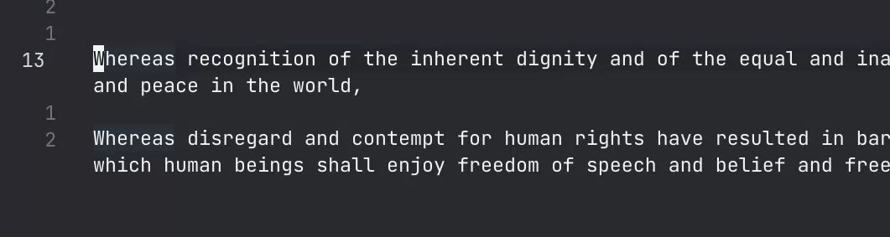

# Jieba for VSCode

基于 `jieba-rs` 的 wasm 版本实现的 VSCode 中文分词插件。

VS Code 本身以及 Vim、Emacs 插件都不具备中文分词功能。比如 Vim 插件只能在以空格或标点符号分割的词语之间跳转，但这明显不适合中文编辑。

这个插件则弥补了 VSCode 在这方面的缺陷，使得用户能够以词为单位，高效编辑中文文本。

本插件的目标为在纯中文以及中英混合文本中模拟 Vim 或 Emacs 中的按键移动，但部分行为与 Vim 或 Emacs 原生行为并不一致，具体请见 [使用建议](#使用建议) 部分。

## 使用方式

| 命令                     | 描述                         | 默认键位                      |
| ------------------------ | ---------------------------- | ----------------------------- |
| `jieba.forwardWord`      | 将光标移至词尾               | `Shift` + `Alt` + `F`         |
| `jieba.backwardWord`     | 将光标移至词首               | `Shift` + `Alt` + `B`         |
| `jieba.killWord`         | 光标前进删除一个词           | `Shift` + `Alt` + `D`         |
| `jieba.backwardKillWord` | 光标后退删除一个词           | `Shift` + `Alt` + `Backspace` |
| `jieba.selectWord`       | 选中光标下方的一个词         | `Shift` + `Alt` + `2`         |
| `jieba.vimLikeLowerW`    | 将光标移动至下一个单词的词头 |                               |
| `jieba.vimLowerE`        | 将光标移动至下一个单词的词尾 |                               |

## 示例




## 使用建议

### Vim 插件

可以做如下键位绑定：

```json
"vim.normalModeKeyBindings": [
    {
        "before": ["w"],
        "commands": ["jieba.vimLikeLowerW"]
    },
    {
        "before": ["e"],
        "commands": ["jieba.vimLowerE"]
    }
],
```

注意：

- `w` 的行为与 Vim 原生不完全一致，主要体现在对空行的行为上。Vim 的 `w` 将空行视作单词，而此处的 `jieba.vimLikeLowerW` 会连续跳过空行直至下一个非空行的首个非空白字符。
- `e` 的行为与 Vim 原生一致。Vim 原生的 `e` 就会连续跳过空行，此处的 `jieba.vimLowerE` 也是如此。
- 暂未实现完全与 Vim 原生一致的 `dw`、`yw` 等操作。

### Emacs 插件

**待完成**

注意：

- 本插件在遇到换行符时的行为与 Emacs 不同：比如 Emacs 的 `Alt+F` 会从行尾空格跳转到下一行第一个词的末尾，本插件则是跳转到下一行的行首。
- 删除的内容将写入系统剪贴板。多指针模式下删除时，剪贴板里将会是第一个指针删除的内容。

## 构建方法

克隆本存储库，使用 VS Code 打开，在终端运行 `npm install`，按 `F5` 进行 Debugging。

## 相关项目

- [jieba-rs](https://github.com/messense/jieba-rs)
- [jieba-wasm](https://github.com/fengkx/jieba-wasm)
- [deno-bridge-jieba](https://github.com/ginqi7/deno-bridge-jieba)
